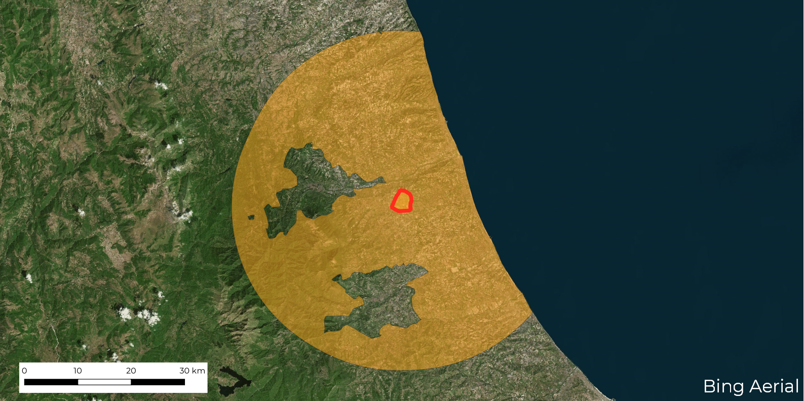

# 30cappa

Il [decreto legge numero 172 del 18 dicembre 2020](https://www.gazzettaufficiale.it/eli/id/2020/12/18/20G00196/s)  -  detto in maniera un po' fastidiosa "di Natale"  -  definisce delle misure urgenti per le festività natalizie e di inizio anno nuovo.

In questo si legge:

> nei giorni **28, 29, 30 dicembre 2020** e **4 gennaio 2021** si applicano le misure di cui all'articolo 2 del [medesimo decreto](http://www.governo.it/sites/new.governo.it/files/dpcm_20201203_txt.pdf) del Presidente del Consiglio dei ministri 3 dicembre 2020, ma sono altresì **consentiti** gli **spostamenti** dai **comuni con popolazione non superiore a 5.000 abitanti** e** per una distanza non superiore a 30 chilometri dai relativi confini**, con **esclusione** in ogni caso degli **spostamenti verso i capoluoghi di provincia**.

[aborruso](https://twitter.com/aborruso), [napo](https://twitter.com/napo) e [pigreco](https://twitter.com/totofiandaca), hanno prodotto degli elaborati per avere un quadro del contesto geografico e numerico di questi spostamenti di **30 km** (i 30 "cappa" 😉).

Tutti i dettagli in questo post:
<https://medium.com/tantotanto/il-decreto-di-natale-in-chilometri-8af38744a7d5>

