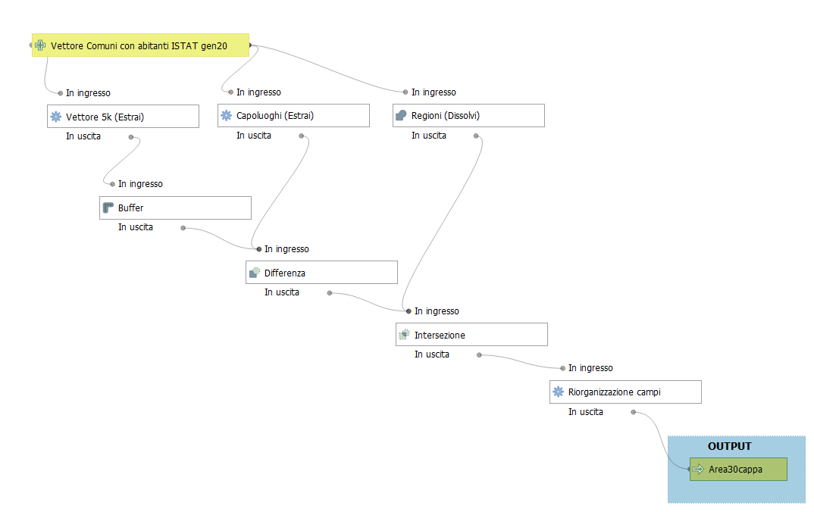

# Contenuto della cartella QGIS

La cartella contiene i dati, progetto e script utili per risolvere i `30cappa` del Decreto di Natale.

## Struttura cartella

La struttura di base è:

```
script/
│
├── QGIS/
│   ├── dati/
|       ├── Italy.geojson
|       ├── aree30cappa.sqlite
|       ├── comuni.*
|       ├── province.csv
|       ├── regioni.csv
|       ├── regioni_vett.geojson
|   ├── output/
|       ├── Aree30cappa.*
|       ├── lista_nro_comuni_x_comune5k.csv
|       ├── stile.qml
|   ├── scriptSQL/
|       ├── script.sql
|       ├── script_atlas.sql
|   ├── 30cappa.model
|   ├── 30cappaAtlas.model
|   ├── 30cappaAtlas.qgs
|   ├── pagima_atlas.pdf
|   ├── modello_all_FINALE.png

```

## descrizione 

cartella | nome file | descrizione
---------|-----------|-----------
dati     | Italy.geojson | limiti nazionali
dati     | aree30cappa.sqlite | database con elaborazioni
dati     | comuni.* | shapefile ISTAT 2020 con aggiunto il campo abitanti ISTAT 01/01/2020
dati     | province.csv | tabella con moni e sigle province
dati     | regioni.csv | tabella con nomi regioni
dati     | regioni_vett.geojson | vettore con le regioni italiane
output   | Aree30cappa.* | shapefile output modello
output   | lista_nro_comuni_x_comune5k.csv | tabella con la lista dei comuni, output dello script_atlas.sql
output   | stile.qml | stile per QGIS
scriptSQL| script.sql | script SQL da usare in spatialite_gui, genera aree30cappa
scriptSQL| script_atlas.sql | script SQL da usare in spatialite_gui, genera tabella lista_nro_comuni_x_comune5k
QGIS     | 30cappa.model | modello per QGIS
QGIS     | 30cappaAtlas.model | modello per QGIS per l'Atlas
QGIS     | 30cappaAtlas.qgs | progetto QGIS
QGIS     | modello_all_FINALE.png | immagine del workflow del modello

## atlas

Nel progetto QGIS sono presenti due Atlas, uno con layout orizzontale e l'altro verticale:

