# Il decreto 'di Natale' sugli spostamenti piccoli comuni
Con [Maurizio](https://twitter.com/napo) e [Andrea](https://twitter.com/aborruso) abbiamo raccontato [Il decreto “di Natale”](https://medium.com/tantotanto/il-decreto-di-natale-in-chilometri-8af38744a7d5), in chilometri, ovvero come calcolare le aree in cui sarà possibile spostarsi nei giorni 28, 29, 30 dicembre 2020 e 4 gennaio 2021, secondo quanto indicato nel [Decreto Legge numero 172 del 18 dicembre 2020](https://www.gazzettaufficiale.it/eli/id/2020/12/18/20G00196/s).

Maurizio le ha calcolate usando [Python](https://github.com/ondata/30cappa/blob/main/script/conpython/README.md), Andrea l’ha fatto “[a riga di comando](https://github.com/ondata/30cappa/blob/main/script/arigadicomando/dataETL.sh)”; io l'ho fatto con [QGIS](https://pigrecoinfinito.com/2020/12/26/il-decreto-di-natale-in-chilometri/) e SpatiaLite.

Come ho risolto il #30cappa del decreto "di Natale".

<!-- TOC -->

- [Il decreto 'di Natale' sugli spostamenti piccoli comuni](#il-decreto-di-natale-sugli-spostamenti-piccoli-comuni)
  - [Software usati](#software-usati)
  - [Osservazioni](#osservazioni)
  - [Limiti amministrativi comunali](#limiti-amministrativi-comunali)
  - [Creo Buffer di 30 km](#creo-buffer-di-30-km)
  - [Estraggo i soli capoluoghi di provincia](#estraggo-i-soli-capoluoghi-di-provincia)
  - [Unisco tutti i comuni](#unisco-tutti-i-comuni)
  - [Suddivito lo stivale](#suddivito-lo-stivale)
  - [Estraggo le parti elementari](#estraggo-le-parti-elementari)
  - [Taglio i buffer da 30 km](#taglio-i-buffer-da-30-km)
  - [Ricompongo i pezzi](#ricompongo-i-pezzi)
  - [Taglio i buffer](#taglio-i-buffer)
  - [Ricompongo i pezzi](#ricompongo-i-pezzi-1)
  - [Associo i dati necessari](#associo-i-dati-necessari)
  - [Cancello le tabelle](#cancello-le-tabelle)
  - [Aggiorno statistiche del database e avvio ottimizzazione](#aggiorno-statistiche-del-database-e-avvio-ottimizzazione)
  - [Riferimenti utili](#riferimenti-utili)

<!-- /TOC -->

## Software usati
- **SpatiaLite 5.0** e le sue incredibile funzioni spaziali. 
- Per la visualizzazione ho usato **QGIS 3.16 Hannover**.

## Osservazioni

- nello script SQL utilizzerò la funzione `ST_Cutter()` che sfrutta le _chiavi primarie_ delle geo-tabelle, quindi è necessario crearle tramite definizione diretta dei campi, e definire una `primary key` per ogni tabella;
- uso sempre `DROP TABLE IF EXISTS "nomeTabella";` ad inizio processo, perché se la tabella che sto creando esistesse già del database, verrebbe cancellata e non mi segnalerebbe errore (`IF EXISTS`);
- uso sempre `CastToMultiPolygon(geometry)` sulla geometria per lavorare o forzare sempre il tipo di geometria come `MultiPolygon`;
- quando creo una nuova geo-tabella, va aggiunto `SELECT AddGeometryColumn ('nomeTabella','nomeCampoGeom',EPSG,'tipoGeometria','dimensione');`
- quando rigenero una geo-tabella, va aggiunto `SELECT RecoverGeometryColumn('nomeTabella','nomeCampoGeom',EPSG,'tipoGeometria','dimensione');`

↑[torna su](#il-decreto-di-natale-sugli-spostamenti-piccoli-comuni)↑

## Limiti amministrativi comunali
Shapefile ISTAT al 01/01/2020 con aggiunto il campo abitanti (01/01/2020), il processo è spiegato [nell post](https://medium.com/tantotanto/lelaborazione-dei-dati-per-la-mappa-del-decreto-di-natale-in-chilometri-9b95e4dbc975) di [Andrea Borruso](https://twitter.com/aborruso); non è un processo molto complesso, ma occorre una pulizia preventiva del dataset.


## Creo Buffer di 30 km
sui comuni con popolazione <= 5.000 (è uno dei requisiti del Decreto)

```sql
-- crea tabella - buffer da 30 km su comuni da 5k
DROP TABLE IF EXISTS "b30k_comuni5k"; -- se esiste cancella la tabella
CREATE TABLE "b30k_comuni5k"
      ("pk_uid" integer PRIMARY KEY autoincrement NOT NULL,"pro_com_t" text);
-- aggiunge campo geom, fissa EPSG, tipo di geometria e dimensione
SELECT AddGeometryColumn ('b30k_comuni5k','geom',32632,'MULTIPOLYGON','XY');
-- popola la tabella con abitanti minori di 5001
INSERT INTO "b30k_comuni5k"
(pk_uid, pro_com_t, geom)
SELECT pk_uid, pro_com_t, CastToMultiPolygon(ST_Buffer (geom,30000)) AS geom
FROM (SELECT pk_uid,pro_com_t, geom 
      FROM "Com01012020_g_WGS84"
      WHERE abitanti <=5000); -- condizione sulla popolazione
```

ci sono alcuni comuni con `enclave` e quindi il buffer sarà come illustrato sotto:

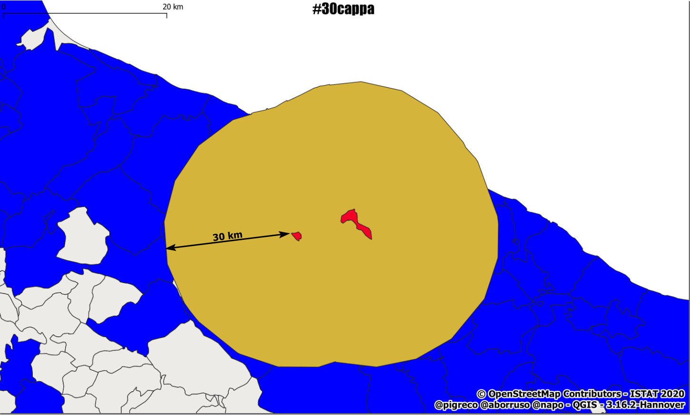

↑[torna su](#il-decreto-di-natale-sugli-spostamenti-piccoli-comuni)↑

## Estraggo i soli capoluoghi di provincia
la condizione è sul campo `CC_UTS` della tabella attributi dello shapefile Comuni, che ha solo due valori 1, 0; serviranno successivamente per tagliare i buffer da 30 km

```sql
-- crea tabella - capoluoghi di provincia
DROP TABLE IF EXISTS "capoluoghi_prov";
CREATE TABLE "capoluoghi_prov" 
      ("pk_uid" integer PRIMARY KEY autoincrement NOT NULL,"pro_com_t" text);
-- aggiunge campo geom, fissa EPSG, tipo di geometria e dimensione
SELECT AddGeometryColumn ('capoluoghi_prov','geom',32632,'MULTIPOLYGON','XY');
-- popola la tabella
INSERT INTO "capoluoghi_prov"
(pk_uid, pro_com_t, geom)
SELECT pk_uid, pro_com_t, geom
FROM (SELECT pk_uid,pro_com_t,geom  
      FROM "Com01012020_g_WGS84"
      WHERE cc_uts != 0); -- condizione sui capoluoghi di provincia
```

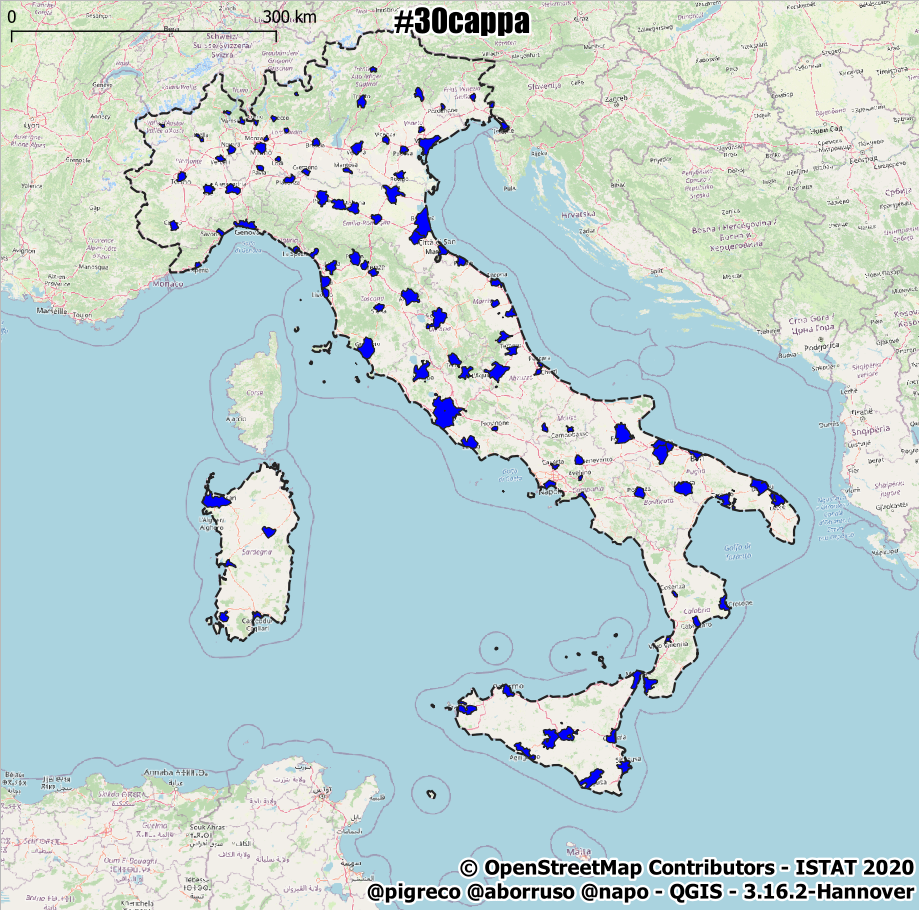

↑[torna su](#il-decreto-di-natale-sugli-spostamenti-piccoli-comuni)↑

## Unisco tutti i comuni
servirà successivamente per ritagliare i buffer con i limiti dell'italico stivale.

Per creare questa tabella preserisco farlo come aggiornamento e quindi utilizzo `UPDATE`.

```sql
-- crea tabella temporanea unendo tutti i comuni
DROP TABLE IF EXISTS "tmp_italia";
CREATE TABLE "tmp_italia" 
      ("pk_uid" INTEGER PRIMARY KEY);
-- aggiunge campo geom, fissa EPSG, tipo di geometria e dimensione
SELECT AddGeometryColumn ('tmp_italia','geom',32632,'MULTIPOLYGON','XY');
-- popola la tabella
INSERT INTO "tmp_italia" VALUES (1,NULL);
-- aggiorna tabella
UPDATE "tmp_italia" SET geom = 
      (SELECT CastToMultiPolygon(ST_Union(geom)) AS geom
       FROM "Com01012020_g_WGS84") 
       WHERE  pk_uid = 1;
```

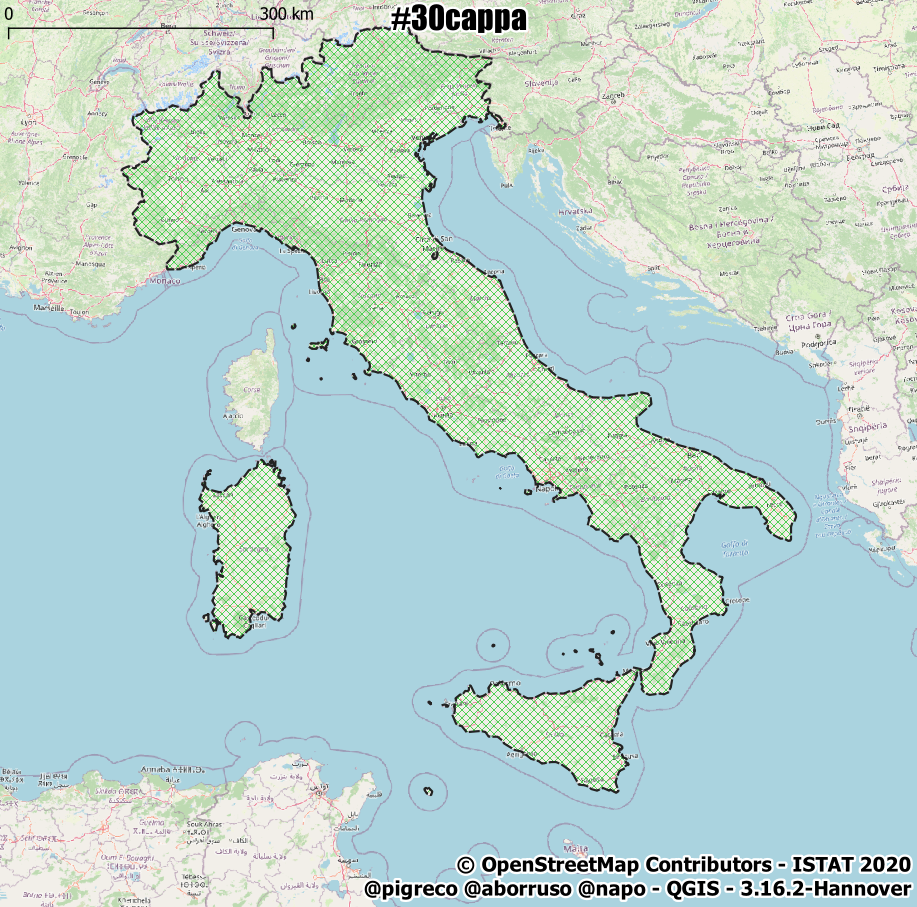

↑[torna su](#il-decreto-di-natale-sugli-spostamenti-piccoli-comuni)↑

## Suddivito lo stivale
la suddivisione evita lunghi tempi di analisi (vale per grandi poligoni); la funzione è presente da SpatiaLite 5, suddivide un poligono a partire dal numero di nodi indicati come argomento:
- `ST_Subdivide(geom,2048)`: richiede il nome del campo geometrico e il numero di nodi, più grande è il numero meno suddivisioni farà;
- in questo caso occorre recuperare la geometria tramite: `SELECT RecoverGeometryColumn('nomeTabella','nomeTabellaGeometria',EPSG,'tipoGeometria','dimensione');`, per maggiori info, vedi riferimenti a fine post;
- la funzione restituisce unica feature, quindi se la geometria di input fosse un `Polygon` restituirebbe un `Multipolygon`;

```sql
-- suddivide l'intero poligono nazionale
DROP TABLE IF EXISTS "italia_subd";
CREATE TABLE "italia_subd" AS
SELECT ST_Subdivide(geom,2048) AS geom FROM "tmp_italia";
-- recupero la geometria
SELECT RecoverGeometryColumn('italia_subd','geom',32632,'MULTIPOLYGON','XY');
```

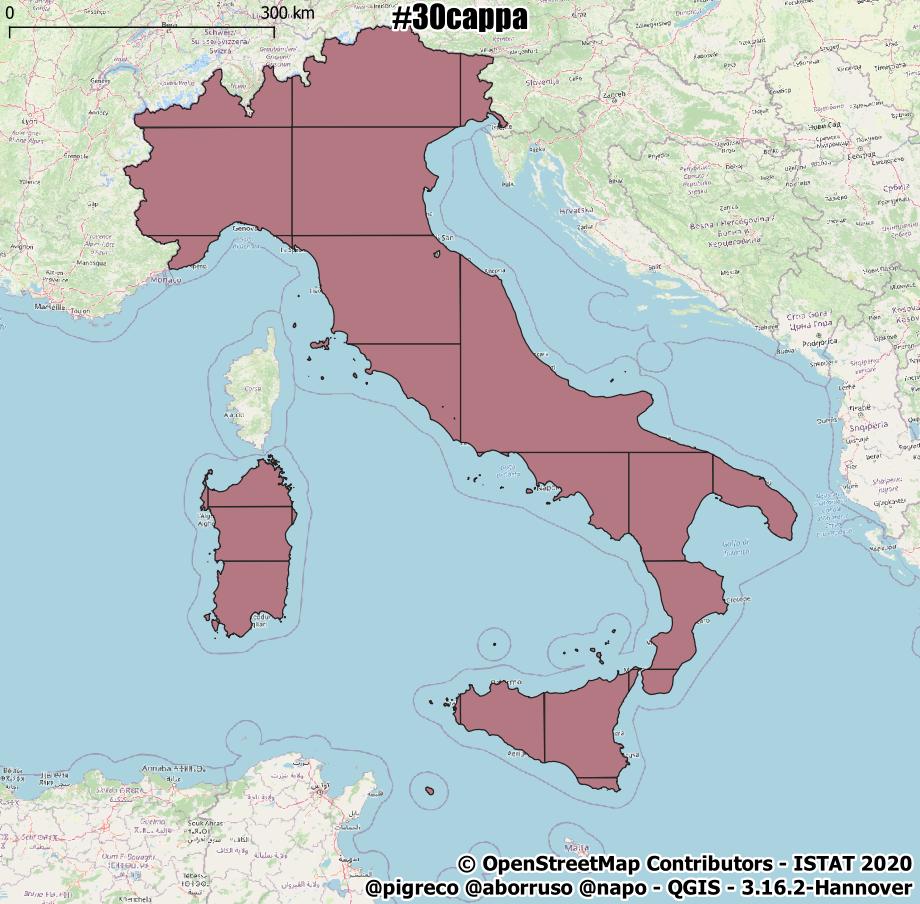

↑[torna su](#il-decreto-di-natale-sugli-spostamenti-piccoli-comuni)↑

## Estraggo le parti elementari
come detto sopra, la suddivisione crea unica feature e quindi occorre esploderla nelle sue parti elementari usando:

- `SELECT ElementaryGeometries( 'nomeTabellaInput','nomeCampo Geometry', 'nomeTabellaOutput', 'chiavePrimariaTabella', 'chiavePrimariaTabellaInput', 1 )`

```sql
-- estrae i poligoni elementari del poligono nazionale
SELECT ElementaryGeometries( 'italia_subd',
                             'geom',
                             'italia_subd_elem',
                             'pk_elem',
                             'out_multi_id', 1 ) as num;
```

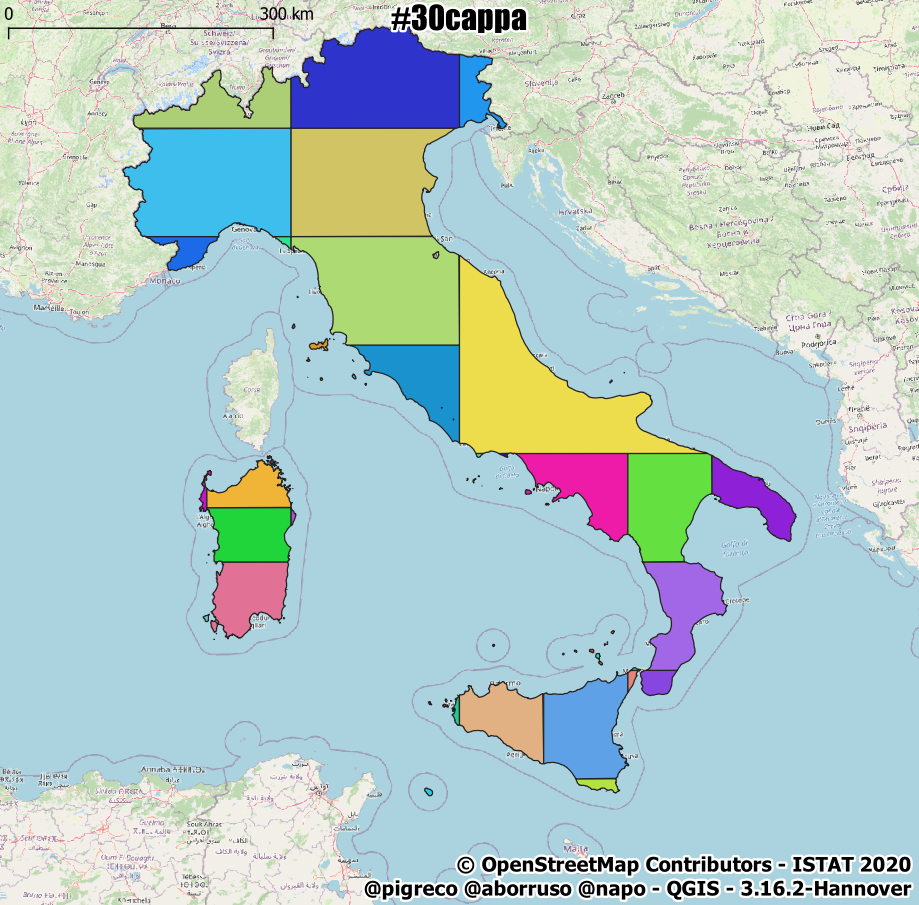

↑[torna su](#il-decreto-di-natale-sugli-spostamenti-piccoli-comuni)↑

##  Taglio i buffer da 30 km 
con l'Italia suddivisa a pezzi: per il taglio (topologico) utilizzo `ST_Cutter()`, una funzione presente a partire dalla versione 4.4 di SpatiaLite: la funzione vuole una geo-tabelle come input e un'altra geo-tabella da usare come `lama` per il taglio:

- `SELECT ST_Cutter(NULL, 'nomeTabellaInput', NULL, NULL, 'nomeTabellaLAMA', NULL, 'nomeTabellaOutput', 1, 1);` per maggiori info, vedi riferimenti a fine post.

```sql
-- taglia i buffer secondo il vettore dato
SELECT ST_Cutter(NULL, 'b30k_comuni5k', NULL, NULL, 'italia_subd_elem', NULL, 'b30k_com5k_italy_subd_elem', 1, 1);
```

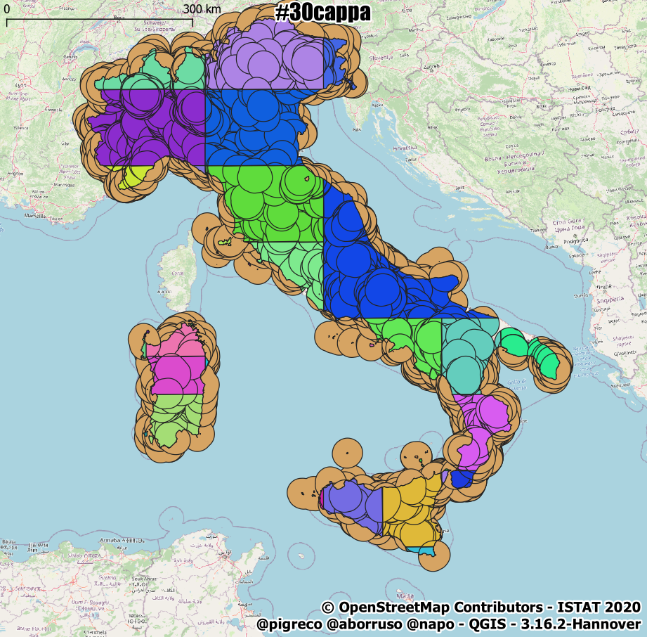

↑[torna su](#il-decreto-di-natale-sugli-spostamenti-piccoli-comuni)↑

## Ricompongo i pezzi
fondo (`ST_Union()`) i buffer da 30 km tagliati in precedenza, il valore `NULL` indica che l'elemento è fuori dalla `lama` e quindi li scartiamo (`WHERE "blade_italia_subd_elem_pk_elem" is NOT NULL`)

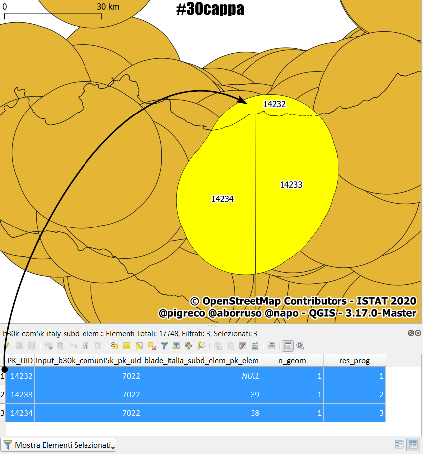

```sql
-- ricompone i pezzi - ricorda che pk_uid si riferisce alla tabella comuni 'Com01012020_g_WGS84'
DROP TABLE IF EXISTS "b30k_com5k_italy";
CREATE TABLE "b30k_com5k_italy" 
      ("pk_uid" INTEGER PRIMARY KEY);
-- aggiunge campo geom, fissa EPSG, tipo di geometria e dimensione
SELECT AddGeometryColumn ('b30k_com5k_italy','geom',32632,'MULTIPOLYGON','XY');
INSERT INTO "b30k_com5k_italy" 
(pk_uid,geom)
SELECT k."input_b30k_comuni5k_pk_uid" AS pk_uid, k.geom
FROM (SELECT "input_b30k_comuni5k_pk_uid", "blade_italia_subd_elem_pk_elem", CastToMultiPolygon(ST_Union("geom")) AS geom
      FROM "b30k_com5k_italy_subd_elem"
      WHERE "blade_italia_subd_elem_pk_elem" is NOT NULL -- scarta gli elementi NULL
      GROUP BY "input_b30k_comuni5k_pk_uid") k;
-- recupero la geometria
SELECT RecoverGeometryColumn('b30k_com5k_italy','geom',32632,'MULTIPOLYGON','XY');
```

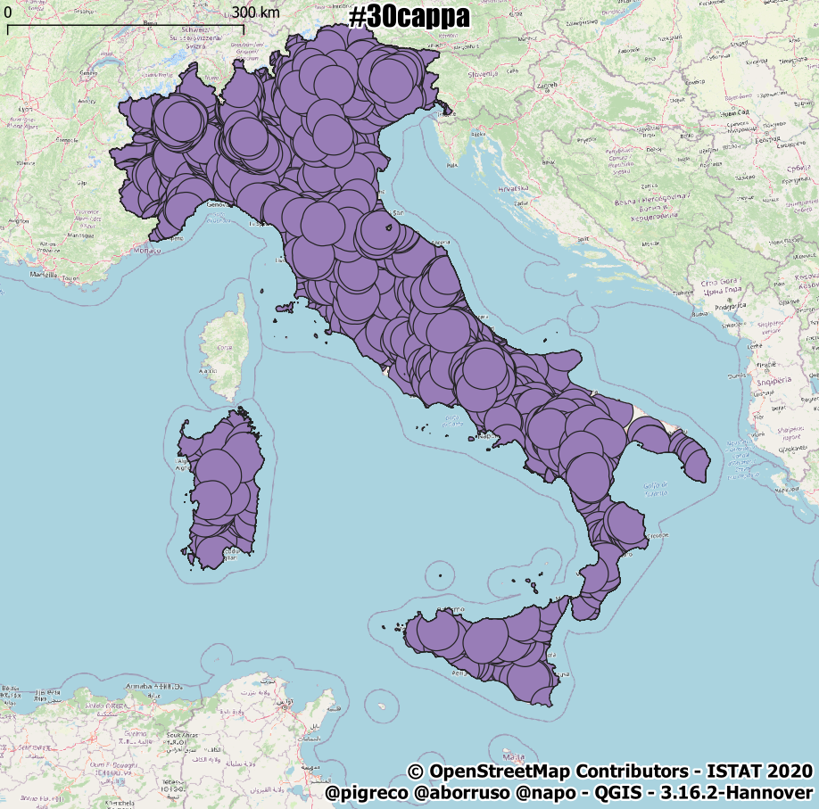

↑[torna su](#il-decreto-di-natale-sugli-spostamenti-piccoli-comuni)↑

## Taglio i buffer
dai buffer 30 km sagomati con lo stivale, taglio i capoluoghi di provincia

```sql
-- taglia i buffer sagomati con lo stivale secondo il vettore dei capoluoghi
SELECT ST_Cutter(NULL, 'b30k_com5k_italy', NULL, NULL, 'capoluoghi_prov', NULL, 'b30k_com5k_italy_subd_elem_capolp', 1, 1);
```

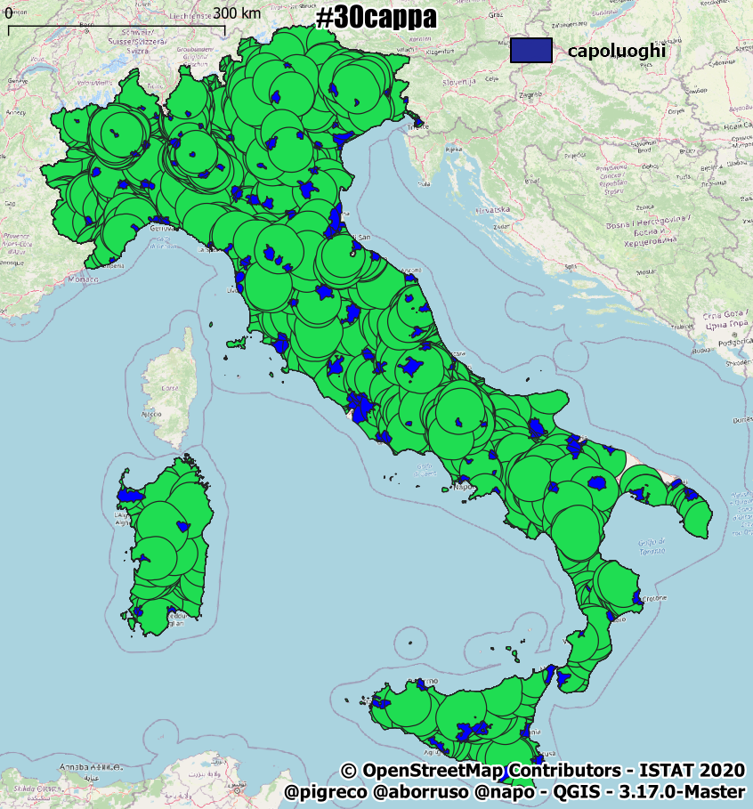

↑[torna su](#il-decreto-di-natale-sugli-spostamenti-piccoli-comuni)↑

## Ricompongo i pezzi
buco e pulisco i buffer (`WHERE "blade_capoluoghi_prov_pk_uid" IS NULL AND ST_Area(geom) > 1`) e li fondo (`ST_Union("geom")`) secondo il criterio usato sopra:

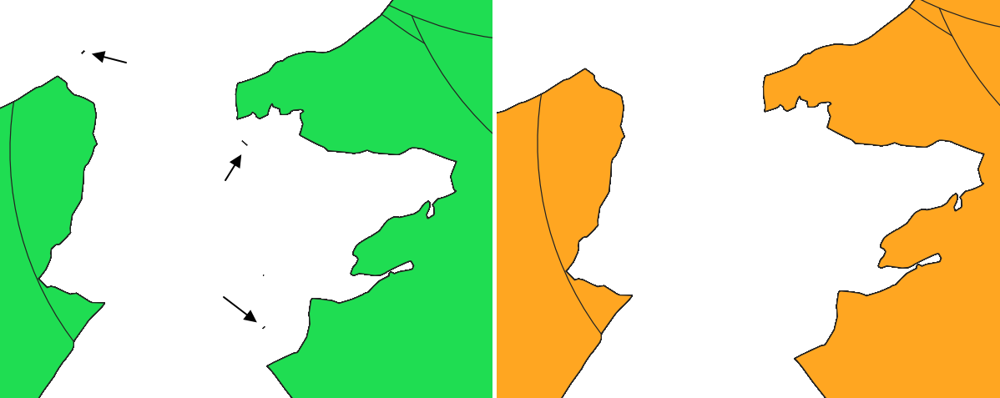

```sql
-- ricompone i pezzi - ricorda che pk_uid si riferisce alla tabella comuni 'Com01012020_g_WGS84'
DROP TABLE IF EXISTS "finale";
CREATE TABLE "finale" 
      ("pk_uid" INTEGER PRIMARY KEY);
-- aggiunge campo geom, fissa EPSG, tipo di geometria e dimensione
SELECT AddGeometryColumn ('finale','geom',32632,'MULTIPOLYGON','XY');
INSERT INTO "finale" 
(pk_uid,geom)
SELECT k."input_b30k_com5k_italy_pk_uid" AS pk_uid, k.geom
FROM (SELECT "input_b30k_com5k_italy_pk_uid", CastToMultiPolygon(ST_Union("geom")) AS geom
      FROM "b30k_com5k_italy_subd_elem_capolp"
      WHERE "blade_capoluoghi_prov_pk_uid" IS NULL AND ST_Area(geom) > 1 -- pulisco
      group by "input_b30k_com5k_italy_pk_uid") k;
SELECT RecoverGeometryColumn('finale','geom',32632,'MULTIPOLYGON','XY');
```


↑[torna su](#il-decreto-di-natale-sugli-spostamenti-piccoli-comuni)↑

## Associo i dati necessari

ricostruisco la tabella con i dati necessari

```sql
-- associa campo pro_com_t ed altri
DROP TABLE IF EXISTS "aree30cappa";
CREATE TABLE "aree30cappa" AS
SELECT f."pk_uid",c."pro_com_t",c."cod_reg",c."comune",c."abitanti",f."geom"
FROM "finale" f left join "Com01012020_g_WGS84" c USING ("pk_uid");
SELECT RecoverGeometryColumn('aree30cappa','geom',32632,'MULTIPOLYGON','XY');
```

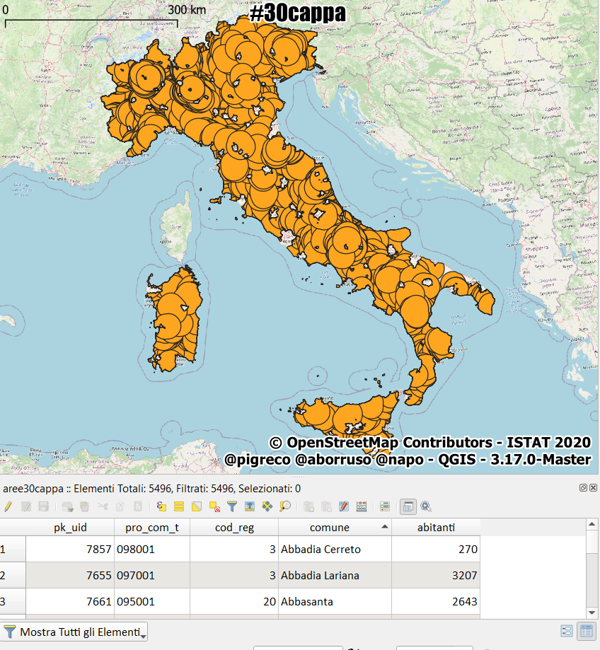

↑[torna su](#il-decreto-di-natale-sugli-spostamenti-piccoli-comuni)↑

## Cancello le tabelle

il processo necessita di tabelle intermedie non più utili

```sql
-- cancella geotabelle inutili
DROP TABLE IF EXISTS "b30k_comuni5k";
DROP TABLE IF EXISTS "capoluoghi_prov";
DROP TABLE IF EXISTS "tmp_italia";
DROP TABLE IF EXISTS "italia_subd";
DROP TABLE IF EXISTS "italia_subd_elem";
DROP TABLE IF EXISTS "b30k_com5k_italy_subd_elem";
DROP TABLE IF EXISTS "b30k_com5k_italy";
DROP TABLE IF EXISTS "b30k_com5k_italy_subd_elem_capolp";
DROP TABLE IF EXISTS "finale";
```

↑[torna su](#il-decreto-di-natale-sugli-spostamenti-piccoli-comuni)↑

## Aggiorno statistiche del database e avvio ottimizzazione

```sql
-- aggiorno statistiche e VACUUM (nel mio vecchio laptop impiega circa 4 minuti)
--
SELECT UpdateLayerStatistics('aree30cappa');
VACUUM;
```

## Riferimenti utili

- **ST_Cutter** : <https://www.gaia-gis.it/fossil/libspatialite/wiki?name=ST_Cutter>
- **ST_Subdivide** : <https://www.gaia-gis.it/fossil/libspatialite/wiki?name=About+ST_Subdivide%28%29>
- **SpatiaLite** :  <https://www.gaia-gis.it/fossil/libspatialite/index>
- **Download SpatiaLite_gui** : <http://www.gaia-gis.it/gaia-sins/windows-bin-NEXTGEN-amd64/>
- **CookBook 5** : <https://www.gaia-gis.it/gaia-sins/spatialite-cookbook-5/index.html>
- **Funzioni SpatiaLite 5** : <https://www.gaia-gis.it/gaia-sins/spatialite-sql-latest.html>
- **Popolazione ISTAT 2020** :  <http://demo.istat.it/pop2020/dati/comuni.zip>
- **confini delle unità amministrative a fini statistici** : <https://www.istat.it/storage/cartografia/confini_amministrativi/generalizzati/Limiti01012020_g.zip>