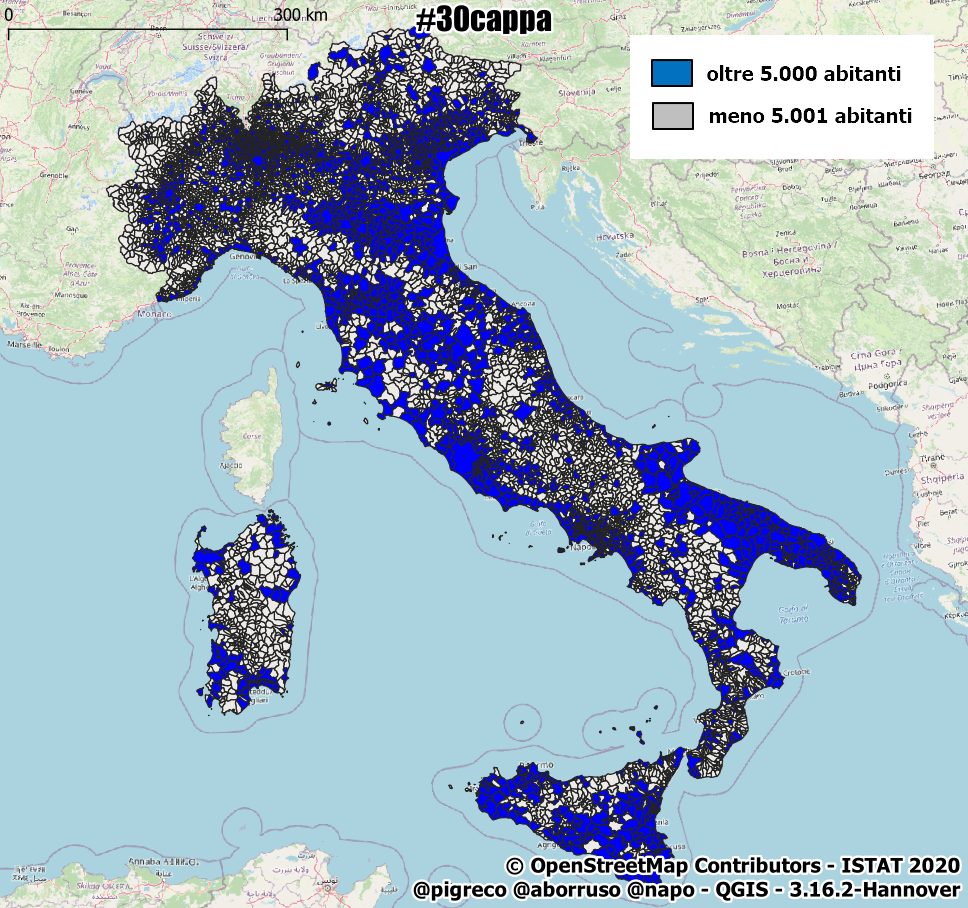

## Il decreto "di Natale" sugli spostamenti piccoli comuni
Come ho risolto il #30cappa del decreto "di Natale".

## Software usati
**SpatiaLite 5.0** e le sue incredibile funzioni spaziali. Per la visualizzazione ho usato **QGIS 3.16 Hannover**

## Osservazioni

- in questo script SQL utilizzerò la funzione `ST_Cutter()` che si basa, fortemente, sulle _chiavi primarie_ delle geo-tabelle, quindi è necessario crearle come fatto sotto, ovvero tramite definizione diretta dei campi.

## Parto dai limiti amministrativi comunali

shapefile ISTAT al 01/01/2020 con aggiunto il campo abitanti (01/01/2020)



## Creo Buffer di 30 km
sui comuni con popolazione <= 5.000

- uso sempre `DROP TABLE IF EXISTS "nomeTabella";` ad inizio processo, perché se la tabella che sto creando esistesse, verrebbe cancellata e non mi segnalerebbe errore (`IF EXISTS`);
- uso sempre `CastToMultiPolygon(geometry)` sulla geometria per lavorare o forzare sempre il tipo di geometria come `MultiPolygon`;
- quando creo una nuova geo-tabella,va sempre aggiunto `SELECT AddGeometryColumn ('nomeTabella','nomeCampoGeom',EPSG,'tipoGeometria','dimensione');`

```sql
-- crea tabella - buffer da 30 km su comuni da 5k
DROP TABLE IF EXISTS "b30k_comuni5k"; -- se esiste cancella la tabella
CREATE TABLE "b30k_comuni5k"
      ("pk_uid" integer PRIMARY KEY autoincrement NOT NULL,"pro_com_t" text);
-- aggiunge campo geom, fissa EPSG, tipo di geometria e dimensione
SELECT AddGeometryColumn ('b30k_comuni5k','geom',32632,'MULTIPOLYGON','XY');
-- popola la tabella con abitanti minori di 5001
INSERT INTO "b30k_comuni5k"
(pk_uid, pro_com_t, geom)
SELECT pk_uid, pro_com_t, CastToMultiPolygon(ST_Buffer (geom,30000)) AS geom
FROM (SELECT pk_uid,pro_com_t, geom 
      FROM "Com01012020_g_WGS84"
      WHERE abitanti <=5000); -- condizione sulla popolazione
```


## Estraggo i soli capoluoghi di provincia
la condizione è sul campo `CC_UTS` che ha solo due valori 1, 0; serviranno successivamente per tagliare i buffer da 30 km

```sql
-- crea tabella - capoluoghi di provincia
DROP TABLE IF EXISTS "capoluoghi_prov";
CREATE TABLE "capoluoghi_prov" 
      ("pk_uid" integer PRIMARY KEY autoincrement NOT NULL,"pro_com_t" text);
-- aggiunge campo geom, fissa EPSG, tipo di geometria e dimensione
SELECT AddGeometryColumn ('capoluoghi_prov','geom',32632,'MULTIPOLYGON','XY');
-- popola la tabella
INSERT INTO "capoluoghi_prov"
(pk_uid, pro_com_t, geom)
SELECT pk_uid, pro_com_t, geom
FROM (SELECT pk_uid,pro_com_t,geom  
      FROM Com01012020_g_WGS84
      WHERE cc_uts != 0); -- condizione sui capoluoghi di provincia
```


## Unisco tutti i comuni
servirà successivamente per sagomare i buffer con lo stivale

```sql
-- crea tabella temporanea unendo tutti i comuni
DROP TABLE IF EXISTS "tmp_italia";
CREATE TABLE "tmp_italia" 
      ("pk_uid" INTEGER PRIMARY KEY);
-- aggiunge campo geom, fissa EPSG, tipo di geometria e dimensione
SELECT AddGeometryColumn ('tmp_italia','geom',32632,'MULTIPOLYGON','XY');
-- popola la tabella
INSERT INTO "tmp_italia" VALUES (1,NULL);
-- aggiorna tabella
UPDATE "tmp_italia" SET geom = 
      (SELECT CastToMultiPolygon(ST_UNION(geom)) AS geom
       FROM "Com01012020_g_WGS84") 
       WHERE  pk_uid = 1;
```


## Suddivito lo stivale
la suddivisione evita lunghi tempi di analisi (vale per grandi poligoni); la funzione è presente da SpatiaLite 5, suddivide un poligono a partire dal numero di nodi indicati come argomento:
- `ST_Subdivide(geom,2048)`: richiede il nome del campo geometrico e il numero di nodi, più grande è il numero meno suddivisioni farà;
- in questo caso occorre recuperare la geometria tramite: `SELECT RecoverGeometryColumn('nomeTabella','nomeTabellaGeometria',EPSG,'tipoGeometria','dimensione');`, per maggiori info, vedi riferimenti a fine post.
- la funzione restituisce unica feature, quindi se la geometria di input è un `Polygon` restituirà un `Multipolygon`;

```sql
-- suddivide l'intero poligono nazionale
DROP TABLE IF EXISTS "italia_subd";
CREATE TABLE "italia_subd" AS
SELECT ST_Subdivide(geom,2048) AS geom FROM "tmp_italia";
-- recupero la geometria
SELECT RecoverGeometryColumn('italia_subd','geom',32632,'MULTIPOLYGON','XY');
```


## Estraggo le parti elementari
la suddivisione crea unica feature e quindi occorre esploderla nelle sue parti elementari

- `SELECT ElementaryGeometries( 'nomeTabellaInput','nomeCampo Geometry', 'nomeTabellaOutput', 'chiavePrimariaTabella', 'chiavePrimariaTabellaInput', 1 )`

```sql
-- estrae i poligoni elementari del poligono nazionale
SELECT ElementaryGeometries( 'italia_subd',
                             'geom',
                             'italia_subd_elem',
                             'pk_elem',
                             'out_multi_id', 1 ) as num;
```


##  Taglio i buffer da 30 km 
con l'Italia suddivisa a pezzi: per il taglio (topologico) utilizzo `ST_Cutter()`, una funzione presente a partire dalla versione 4.4 di SpatiaLite: la funzione vuole una geo-tabelle come input e un'altra geo-tabella da usare come `lama` per il taglio:

- `SELECT ST_Cutter(NULL, 'nomeTabellaInput', NULL, NULL, 'nomeTabellaLAMA', NULL, 'nomeTabellaOutput', 1, 1);`, per maggiori info, vedi riferimenti a fine post.

```sql
-- taglia i buffer secondo il vettore dato
SELECT ST_Cutter(NULL, 'b30k_comuni5k', NULL, NULL, 'italia_subd_elem', NULL, 'b30k_com5k_italy_subd_elem', 1, 1);
```


## Ricompongo i pezzi
fondo (`ST_Union()`) i buffer da 30 km tagliati in precedenza, il valore `NULL` indica che l'elemento è fuori dalla `lama` e quindi li scartiamo (`WHERE "blade_italia_subd_elem_pk_elem" is NOT NULL`)


```sql
-- ricompone i pezzi - ricorda che pk_uid si riferisce alla tabella comuni 'Com01012020_g_WGS84'
DROP TABLE IF EXISTS "b30k_com5k_italy";
CREATE TABLE "b30k_com5k_italy" 
      ("pk_uid" INTEGER PRIMARY KEY);
-- aggiunge campo geom, fissa EPSG, tipo di geometria e dimensione
SELECT AddGeometryColumn ('b30k_com5k_italy','geom',32632,'MULTIPOLYGON','XY');
INSERT INTO "b30k_com5k_italy" 
(pk_uid,geom)
SELECT k."input_b30k_comuni5k_pk_uid" AS pk_uid, k.geom
FROM (SELECT "input_b30k_comuni5k_pk_uid", "blade_italia_subd_elem_pk_elem", CastToMultiPolygon(ST_Union("geom")) AS geom
      FROM "b30k_com5k_italy_subd_elem"
      WHERE "blade_italia_subd_elem_pk_elem" is NOT NULL -- scarta gli elementi NULL
      GROUP BY "input_b30k_comuni5k_pk_uid") k;
-- recupero la geometria
SELECT RecoverGeometryColumn('b30k_com5k_italy','geom',32632,'MULTIPOLYGON','XY');
```


## Taglio i buffer
dai buffer 30 km sagomati con lo stivale, taglio i capoluoghi di provincia

```sql
-- taglia i buffer sagomati con lo stivale secondo il vettore dei capoluoghi
SELECT ST_Cutter(NULL, 'b30k_com5k_italy', NULL, NULL, 'capoluoghi_prov', NULL, 'b30k_com5k_italy_subd_elem_capolp', 1, 1);
```


## Ricompongo i pezzi
buco e pulisco i buffer (`WHERE "blade_capoluoghi_prov_pk_uid" IS NULL AND ST_Area(geom) > 1`) e li fondo (`ST_Union("geom")`) secondo il criterio usato sopra:


```sql
-- ricompone i pezzi - ricorda che pk_uid si riferisce alla tabella comuni 'Com01012020_g_WGS84'
DROP TABLE IF EXISTS "finale";
CREATE TABLE "finale" 
      ("pk_uid" INTEGER PRIMARY KEY);
-- aggiunge campo geom, fissa EPSG, tipo di geometria e dimensione
SELECT AddGeometryColumn ('finale','geom',32632,'MULTIPOLYGON','XY');
INSERT INTO "finale" 
(pk_uid,geom)
SELECT k."input_b30k_com5k_italy_pk_uid" AS pk_uid, k.geom
FROM (SELECT "input_b30k_com5k_italy_pk_uid", CastToMultiPolygon(ST_Union("geom")) AS geom
      FROM "b30k_com5k_italy_subd_elem_capolp"
      WHERE "blade_capoluoghi_prov_pk_uid" IS NULL AND ST_Area(geom) > 1
      group by "input_b30k_com5k_italy_pk_uid") k;
SELECT RecoverGeometryColumn('finale','geom',32632,'MULTIPOLYGON','XY');
```


## Associo i dati necessari

ricostruisco la tabella con i dati necessari

```sql
-- associa campo pro_com_t ed altri
DROP TABLE IF EXISTS "aree30cappa";
CREATE TABLE "aree30cappa" AS
SELECT f."pk_uid",c."pro_com_t",c."cod_reg",c."comune",c."abitanti",f."geom"
FROM "finale" f left join "Com01012020_g_WGS84" c USING ("pk_uid");
SELECT RecoverGeometryColumn('aree30cappa','geom',32632,'MULTIPOLYGON','XY');
```


## Cancello le tabelle inutili

il processo necessita di tabelle intermedie

```sql
-- cancella geotabelle inutili
DROP TABLE IF EXISTS "b30k_comuni5k";
DROP TABLE IF EXISTS "capoluoghi_prov";
DROP TABLE IF EXISTS "tmp_italia";
DROP TABLE IF EXISTS "italia_subd";
DROP TABLE IF EXISTS "italia_subd_elem";
DROP TABLE IF EXISTS "b30k_com5k_italy_subd_elem";
DROP TABLE IF EXISTS "b30k_com5k_italy";
DROP TABLE IF EXISTS "b30k_com5k_italy_subd_elem_capolp";
DROP TABLE IF EXISTS "finale";
```

## Aggiorno statistiche del database e avvio ottimizzazione

```sql
-- aggiorno statistiche e VACUUM (nel mio vecchio laptop impiega circa 4 minuti)
--
SELECT UpdateLayerStatistics('aree30cappa');
VACUUM;
```

## Riferimenti utili

- **ST_Cutter** : https://www.gaia-gis.it/fossil/libspatialite/wiki?name=ST_Cutter
- **ST_Subdivide** : https://www.gaia-gis.it/fossil/libspatialite/wiki?name=About+ST_Subdivide%28%29
- **SpatiaLite** :  https://www.gaia-gis.it/fossil/libspatialite/index
- **Download SpatiaLite_gui** : http://www.gaia-gis.it/gaia-sins/windows-bin-NEXTGEN-amd64/
- **CookBook 5** : https://www.gaia-gis.it/gaia-sins/spatialite-cookbook-5/index.html
- **Funzioni SpatiaLite 5** : https://www.gaia-gis.it/gaia-sins/spatialite-sql-latest.html