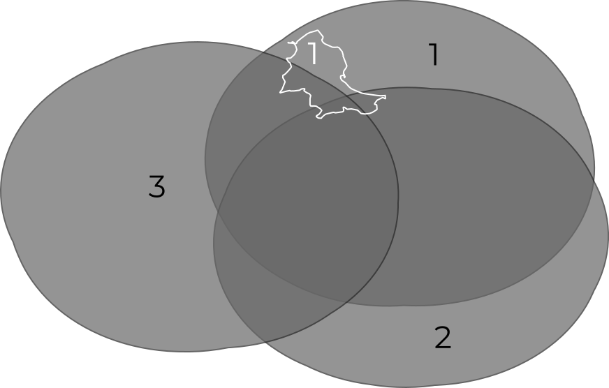
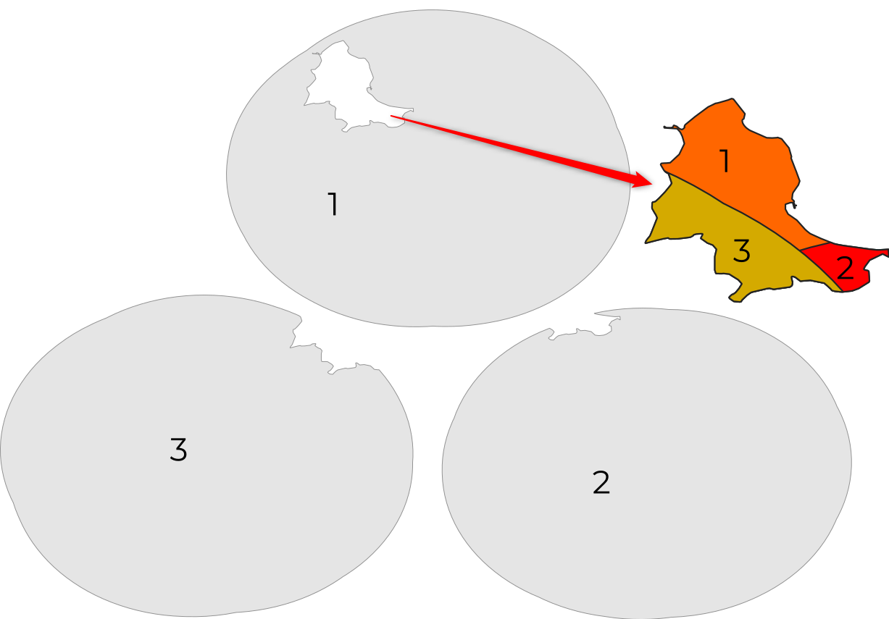

- [Il decreto “di Natale”, in chilometri](#il-decreto-di-natale-in-chilometri)
  - [Sono previsti spostamenti di 30 chilometri: ecco dove, quando e quanto](#sono-previsti-spostamenti-di-30-chilometri-ecco-dove-quando-e-quanto)
    - [Utility usate](#utility-usate)
    - [Lo script](#lo-script)
      - [Elaborazione dati sulla popolazione](#elaborazione-dati-sulla-popolazione)
      - [Elaborazione dati geografici](#elaborazione-dati-geografici)
      - [Elaborazione dati per il sito web](#elaborazione-dati-per-il-sito-web)
    - [Note conclusive](#note-conclusive)

# Il decreto “di Natale”, in chilometri

## Sono previsti spostamenti di 30 chilometri: ecco dove, quando e quanto

Con [Maurizio](https://twitter.com/napo) e [Salvatore](https://twitter.com/totofiandaca) abbiamo raccontato [**Il decreto “di Natale”, in chilometri**](https://medium.com/tantotanto/il-decreto-di-natale-in-chilometri-8af38744a7d5), ovvero come calcolare le aree in cui sarà possibile spostarsi nei giorni 28, 29, 30 dicembre 2020 e 4 gennaio 2021, secondo quanto indicato nel [Decreto Legge numero 172 del 18 dicembre 2020 ](https://www.gazzettaufficiale.it/eli/id/2020/12/18/20G00196/s).

Maurizio le ha calcolate usando [Python](https://github.com/ondata/30cappa/blob/main/script/conpython/README.md), Salvatore [con QGIS e SpatiaLite](https://pigrecoinfinito.com/2020/12/24/il-decreto-di-natale-in-chilometri); io l'ho fatto "**a riga di comando**", sfruttando alcune *utility* e uno [script *bash*](dataETL.sh).

### Utility usate

Lo script *bash* sfrutta principalmente queste 4 *utility*:

- **GDAL/OGR**, la più importante libreria *open source* per leggere e scrivere file geografici vettoriali e *raster* https://gdal.org/
- **Mapshaper** (usare versione >= 0.5.22), una straordinaria applicazione *open source* per modificare file in formato Shapefile, GeoJSON, TopoJSON, CSV, ecc. https://github.com/mbloch/mapshaper
- **Miller**, una straordinaria applicazione *open source* per elaborare file in formato CSV, TSV, ecc. https://miller.readthedocs.io/en/latest/features.html
- **SpatiaLite**, uno straordinaria RDBMS *open source* con funzioni spaziali <https://www.gaia-gis.it/fossil/libspatialite/index>.

Per usare lo *script*, è necessario installarle.

### Lo script

È diviso in tre parti:

- l'elaborazione dei dati sulla popolazione;
- l'elaborazione dei dati geografici;
- l'elaborazione per produrre i dati a supporto della mappa *online* che abbiamo realizzato.

#### Elaborazione dati sulla popolazione

Abbiamo scelto come **fonte** questa di **ISTAT**: <http://demo.istat.it/pop2020/dati/comuni.zip>.<br>Sono dati aggiornati a gennaio 2020 con queste caratteristiche:

- formato CSV;
  - *encoding* `UTF-8`;
  - la `,` come separatore di campi;
- 807.233 righe;
- 2 righe di intestazione, una descrittiva e una con i nomi dei campi;
- 2 righe al piede, con note, a partire da riga 807.232;
- 19 campi. Tra questi:
  - il codice ISTAT in formato numerico del comune;
  - il nome del comune;
  - la classe di età della popolazione, da `0` a `100` a passo di un anno, con uno speciale valore di `999` per il totale di popolazione per comune;
  - il totale di popolazione dei maschi;
  - il totale di popolazione delle femmine;
- per ogni comune un record per ogni classe di età.

Questo un estratto:

```
"Popolazione residente al 1° Gennaio 2020 per sesso età (b) e stato civile post censimento (n)"
Codice comune,Denominazione,Età,Maschi celibi,Maschi coniugati,Maschi divorziati,Maschi vedovi,Maschi uniti civilmente,Maschi già in unione civile (per scioglimento),Maschi già in unione civile (per decesso del partner),Totale Maschi,Femmine nubili,Femmine coniugate,Femmine divorziate,Femmine vedove,Femmine unite civilmente,Femmine già in unione civile (per scioglimento),Femmine già in unione civile (per decesso del partner),Totale Femmine
1001,Agliè,0,5,0,0,0,,,,5,11,0,0,0,,,,11
1001,Agliè,1,9,0,0,0,,,,9,15,0,0,0,,,,15
1001,Agliè,2,6,0,0,0,,,,6,8,0,0,0,,,,8
```

E queste le informazioni di sintesi sullo schema:

| field                                                  | type    | min         | max     | min_length | max_length | mean                  | stddev              | median | mode   | cardinality |
| ------------------------------------------------------ | ------- | ----------- | ------- | ---------- | ---------- | --------------------- | ------------------- | ------ | ------ | ----------- |
| Codice comune                                          | Integer | 1001        | 111107  | 4          | 6          | 45174.040561031616    | 32616.550968795535  | 40025  | N/A    | 7914        |
| Denominazione                                          | Unicode | Abano Terme | Zungri  | 2          | 34         |                       |                     |        | Zungri | 7908        |
| Età                                                    | Integer | 0           | 999     | 1          | 3          | 59.30392156862911     | 97.90058875583402   | 50.5   | N/A    | 102         |
| Maschi celibi                                          | Integer | 0           | 657437  | 1          | 6          | 33.77095442675566     | 1006.9727727317525  | 3      | 0      | 3240        |
| Maschi coniugati                                       | Integer | 0           | 595382  | 1          | 6          | 34.436627569905205    | 925.9212538764326   | 2      | 0      | 3280        |
| Maschi divorziati                                      | Integer | 0           | 39802   | 1          | 5          | 1.8825511503563923    | 62.32985002343896   | 0      | 0      | 668         |
| Maschi vedovi                                          | Integer | 0           | 34367   | 1          | 5          | 1.860064318878973     | 53.77542444503943   | 0      | 0      | 642         |
| Maschi uniti civilmente                                | Integer | 0           | 1648    | 0          | 4          | 0.3779806618128552    | 10.428816258323753  | 0      |        | 80          |
| Maschi già in unione civile (per scioglimento)         | Integer | 0           | 12      | 0          | 2          | 0.003043260526214392  | 0.0909561975397487  | 0      |        | 9           |
| Maschi già in unione civile (per decesso del partner)  | Integer | 0           | 24      | 0          | 2          | 0.0037751839439115484 | 0.15223719532902208 | 0      |        | 8           |
| Totale Maschi                                          | Integer | 0           | 1328672 | 1          | 7          | 71.97494635963314     | 2041.7766432801977  | 10     | 0      | 4665        |
| Femmine nubili                                         | Integer | 0           | 619849  | 1          | 6          | 29.1584583289974      | 930.2729647386509   | 2      | 0      | 2966        |
| Femmine coniugate                                      | Integer | 0           | 622722  | 1          | 6          | 34.93128831011793     | 960.3575344588396   | 2      | 0      | 3282        |
| Femmine divorziate                                     | Integer | 0           | 73590   | 1          | 5          | 2.7011674520704756    | 109.60897785110757  | 0      | 0      | 819         |
| Femmine vedove                                         | Integer | 0           | 162700  | 1          | 6          | 8.991179691487366     | 256.8362857139779   | 0      | 0      | 1569        |
| Femmine unite civilmente                               | Integer | 0           | 747     | 0          | 3          | 0.17369698370507336   | 4.320684602241422   | 0      |        | 46          |
| Femmine già in unione civile (per scioglimento)        | Integer | 0           | 12      | 0          | 2          | 0.0032743942370661314 | 0.08923783595966905 | 0      |        | 8           |
| Femmine già in unione civile (per decesso del partner) | Integer | 0           | 9       | 0          | 1          | 0.0032358719519242057 | 0.08923924112796663 | 0      |        | 8           |
| Totale Femmine                                         | Integer | 0           | 1479621 | 1          | 7          | 75.79368406447678     | 2244.6609533014753  | 11     | 0      | 4748        |

Per poterlo utilizzare è necessario rimuovere la prima riga di intestazione. Nello script è stata rimossa con [`tail`](https://pubs.opengroup.org/onlinepubs/9699919799/utilities/tail.html#top), con l'opzione `-n` e l'argomento `2`, per avere in output il file a partire dalla seconda riga:

```bash
tail <./comuni.csv -n +2
```

Successivamente le righe al piede, che contengono le note. <br>Viene fatto in due passaggi: prima estraendo la riga che contiene i nomi dei campi, e poi aggiungendo a questa tutte le righe che iniziano con un numero (quindi tutto, tranne le righe con le note).<br>Gli strumenti sono i due classici `head`, per estrarre soltanto la prima riga, e `grep` per filtrare tramite espressioni regolari le righe che iniziano con un numero:

```bash
# estri riga con nomi campo
head <./comuni.csv -n 1 >./tmp_comuni.csv
# aggiungi corpo, rimuovendo ciò che non inizia per codice comune (in modo da rimuovere footer)
grep <./comuni.csv -P '^[0-9]+' >>./tmp_comuni.csv
# rinomina file
mv ./tmp_comuni.csv ./comuni.csv
```

Il passo successivo è quello di estrarre il totale di popolazione per comune. Per come è fatto il file, è necessario estrarre tutte le righe in cui `Età=="999"` e fare poi la somma del totale di maschi e femmine.<br>A questo è stata aggiunta l'estrazione dei campi `Codice comune` e `Abitanti` (e la rimozione dei restanti) e il loro cambio nome.<br>
Ho usato Miller:

```bash
mlr -I --csv clean-whitespace \
  then filter -S '${Età}=="999"' \
  then put '$Abitanti=${Totale Maschi}+${Totale Femmine}' \
  then cut -f "Codice comune",Abitanti \
  then rename "Codice comune",PRO_COM_T ./comuni.csv
```

La sintassi di Miller è molto leggibile. Qualche nota:

- ai nomi di campo si fa riferimento con `$` seguito da nome campo. Qui sono state aggiunte le parentesi graffe, perché siamo in presenza di nomi "speciali", con spazi e accentate;
- viene applicato il comando `clean-whitespace` (in Miller si chiamano "verbi"), per rimuovere eventuali spazi bianchi "in più", ovvero 1 o più a inizio e fine cella, e più di 1 tra caratteri in un cella;
- l'opzione `-I` fa in modo che il comando lavori in sovrascrittura sul file.

In ultimo si è scelto di `standardizzare` il codice ISTAT dei comuni, da campo numerico a campo testuale a 6 caratteri: ad esempio trasformare il codice `1001` del comune di Agliè in `001001`. <br>Usando in Miller il "verbo" [`put`](https://miller.readthedocs.io/en/latest/reference-verbs.html#put) e la fuzione [`fmtnum`](https://miller.readthedocs.io/en/latest/reference-dsl.html#fmtnum):

```bash
mlr -I --csv put '$PRO_COM_T=fmtnum($PRO_COM_T,"%06d")' ./comuni.csv
```

#### Elaborazione dati geografici

Ancora una volta la **fonte** è **ISTAT**, in particolare la versione generalizzata dei "confini delle unità amministrative a fini statistici":<br><https://www.istat.it/storage/cartografia/confini_amministrativi/generalizzati/Limiti01012020_g.zip>.

Sono dati aggiornati a gennaio 2020 con queste caratteristiche:

- formato Shapefile
  - *encoding* `UTF-8`;
  - sistema di coordinate [`EPSG:32632`](https://epsg.io/32632);
  - tipo geometrico `Polygon`;
- 13 campi, con i codici ISTAT di ogni comune a tutti i livelli amministrativi gerarchici, il nome, l'area e il perimetro del poligono che rappresenta il confine comunale
- un record per ogni comune italiano, quindi 7904 in totale.

Questo un estratto:

```
+---------+---------+----------+--------+---------+---------+-----------+-------------+----------+--------+-------------+-----------+
| COD_RIP | COD_REG | COD_PROV | COD_CM | COD_UTS | PRO_COM | PRO_COM_T | COMUNE      | COMUNE_A | CC_UTS | SHAPE_AREA  | SHAPE_LEN |
+---------+---------+----------+--------+---------+---------+-----------+-------------+----------+--------+-------------+-----------+
| 3       | 12      | 60       | 0      | 60      | 60037   | 060037    | Fontechiari | -        | 0      | 16270605.91 | 16457.49  |
| 2       | 5       | 28       | 0      | 28      | 28044   | 028044    | Legnaro     | -        | 0      | 15712001.07 | 17663.17  |
| 3       | 9       | 46       | 0      | 46      | 46031   | 046031    | Vagli Sotto | -        | 0      | 41459091.05 | 28108.08  |
| 3       | 12      | 56       | 0      | 56      | 56034   | 056034    | Marta       | -        | 0      | 33594560.89 | 26695.50  |
| 2       | 8       | 37       | 237    | 237     | 37035   | 037035    | Malalbergo  | -        | 0      | 54059370.35 | 42717.13  |
+---------+---------+----------+--------+---------+---------+-----------+-------------+----------+--------+-------------+-----------+
```

E queste le informazioni di sintesi sullo schema:

| field      | type    | min         | max           | min_length | max_length | mean                 | stddev             | median      | mode | cardinality |
| ---------- | ------- | ----------- | ------------- | ---------- | ---------- | -------------------- | ------------------ | ----------- | ---- | ----------- |
| COD_RIP    | Integer | 1           | 5             | 1          | 1          | 2.4862095141700404   | 1.4286548784684956 | 2           | 1    | 5           |
| COD_REG    | Integer | 1           | 20            | 1          | 2          | 8.659286437246942    | 6.388341980201931  | 7           | 3    | 20          |
| COD_PROV   | Integer | 1           | 111           | 1          | 3          | 45.130819838056745   | 32.64463443546327  | 40          | 1    | 107         |
| COD_CM     | Integer | 0           | 292           | 1          | 3          | 38.92054655870437    | 90.042657529667    | 0           | 0    | 16          |
| COD_UTS    | Integer | 2           | 292           | 1          | 3          | 77.22039473684187    | 79.31575427084252  | 57          | 201  | 108         |
| PRO_COM    | Integer | 1001        | 111107        | 4          | 6          | 45193.82059716597    | 32622.605152620454 | 40034.5     | N/A  | 7904        |
| PRO_COM_T  | Unicode | 001001      | 111107        | 6          | 6          |                      |                    |             | N/A  | 7904        |
| COMUNE     | Unicode | Abano Terme | Zungri        | 2          | 34         |                      |                    |             | N/A  | 7898        |
| COMUNE_A   | Unicode | Abtei       | Števerjan     | 0          | 36         |                      |                    |             |      | 125         |
| CC_UTS     | Integer | 0           | 1             | 1          | 1          | 0.013790485829959558 | 0.1166203598456684 | 0           | 0    | 2           |
| SHAPE_AREA | Float   | 103841.59   | 1286515935.04 | 9          | 13         | 38212174.82759485    | 50775638.830618076 | 22462066.48 | N/A  | 7904        |
| SHAPE_LEN  | Float   | 1327.5      | 279961.61     | 7          | 9          | 28724.054496457524   | 19071.825497349204 | 23815.9     | N/A  | 7898        |

Come scritto nell'[**articolo che presenta il progetto**](https://medium.com/tantotanto/il-decreto-di-natale-in-chilometri-8af38744a7d5), dato un comune con non più di **5.000 abitanti**, e il suo confine, per calcolare l'area in cui da questo è possibile spostarsi (nei giorni 28, 29, 30 dicembre 2020 e 4 gennaio 2021), è necessario per ogni comune:

- calcolare l'area di **buffer** attorno al confine, di **30.000 metri**;
- rimuovere da questa l'eventuale **area** dei **comuni** **capoluogo** che ricadono all'interno;
- rimuovere la parte che va **al di fuori** dei **confini nazionali**.

Il *buffer*, il luogo dei punti distanti 30.000 metri dal confine comunale, è stato calcolato tramite `ogr2ogr`:

```bash
ogr2ogr -t_srs EPSG:4326 ./comuni_30cappa_5mila.shp ./comuni.shp \
-dialect sqlite \
-sql "SELECT PRO_COM_T,COD_REG,COMUNE,Abitanti,st_buffer(comuni.geometry,30000) AS geom FROM comuni where Abitanti <= 5000"
```

Alcune note:

- come sistema di coordinate di *output* è stato scelto `EPSG:4326`, perché compatibile in modo nativo con le librerie per la pubblicazione di mappe sul *web*;
- il *buffer* viene calcolato tramite una interrogazione `SQL` di tipo spaziale, sfruttando il dialetto `sqlite` e la funzione [`ST_BUFFER`](https://www.gaia-gis.it/gaia-sins/spatialite-sql-latest.html#:~:text=space\)-,Buffer). Questa vuole come argomenti la colonna geometrica e la distanza (di *default* usando l'unità di misura nativa, che qui sono metri);
- vengono estratte soltanto le colonne utili per l'applicazione creata (codice comunale a 6 caratteri, codice regionale numerico e numero di abitanti).

I **poligoni** dei **capoluoghi** sono tutti quelli che nel *file* di *input* hanno `CC_UTS==1`. Vengono estratti con [`Mapshaper`](https://github.com/mbloch/mapshaper/wiki/Command-Reference):

```bash
mapshaper ./comuni.shp \
-filter 'CC_UTS==1' \
-filter-fields PRO_COM_T,COD_REG,COMUNE,Abitanti \
-proj wgs84 \
-o ./capoluoghi_4326.shp
```

La sintassi di Mapshaper è molto leggibile. Vengono estratti soltanto alcuni campi (come nella creazione dei *buffer*) e per le ragioni precedenti viene scelto `EPSG:4326` come sistema di coordinare di *output*.

Per creare il **limite** **poligonale** dello **stato** **italiano**, basta unire - fare il *dissolve* - dei poligoni dei comuni del file di *input*.<br>Con `Mapshaper`:

```bash
mapshaper ./comuni.shp -dissolve \
-proj wgs84 \
-o precision=0.000001 ./italia.shp
```

Il comando [`dissolve`](https://github.com/mbloch/mapshaper/wiki/Command-Reference#-dissolve) è il cuore del processo e ancora una volta in *output* `EPSG:4326`.

Questo *output* viene usato per **ritagliare** le aree di *buffer* dei comuni. Si utilizza il comando [`clip`](https://github.com/mbloch/mapshaper/wiki/Command-Reference#-clip) di Mapshaper:

```bash
mapshaper ./comuni_30cappa_5mila.shp -clip ./italia.shp -o ./output.shp
```

#### Elaborazione dati per il sito web

La pagina web per presentare le aree in cui - per ogni comune - è possibile spostarsi ha una struttura di `URL` di questo tipo:<br>
`https://ondata.github.io/30cappa/mappa.html?id=067042`.

Al cambio di `id`, che qui è il codice ISTAT a caratteri del comune di proprio interesse - viene aperta una mappa centrata sul *buffer* di quel comune, con evidenziate l'area in cui è possibile spostarsi e il limite comunale.

Quella del comune viene restituita in risposta a un'interrogazione alle [API SQL di CARTO](https://carto.com/developers/sql-api/), mentre quella del buffer è una chiamata diretta al file `
GeoJSON` che rappresenta il *buffer* di 30.000 metri del confine di un dato comune.<br>
È quindi necessario generare circa **5.500 file**, perché tanti sono i comuni con abitanti `<=5.000`.

Il comando essenziale "geografico" mancante è quello che sottrae all'aerea in cui ci si può spostare, quella occupata dai comuni capoluogo. Nell'immagine di sotto, ad esempio, quella di Teramo e Ascoli Piceno.


Per rimuovere queste aree, è stato utilizzato SpatiaLite e una sua funzione specializzata, [`ST_CUTTER`](https://www.gaia-gis.it/fossil/libspatialite/wiki?name=ST_Cutter) (attiva dalla versione `4.4`). Questo per la sua semplicità di utilizzo e rapidità di esecuzione.

Si inizia allora dall'**importare** i file Shapefile in un nuovo *database* in formato SpatiaLite. La struttura del comando è:

```bash
ogr2ogr -f SQLite -dsco SPATIALITE=YES ./db.sqlite ./input.shp -nln nomeTabellaOutput -lco SPATIAL_INDEX=YES -nlt PROMOTE_TO_MULTI
```

Il *layer* dei buffer ha una certa complessità. È opportuno in questi casi imporre una **validazione geometrica** e conseguente **correzione**:

```bash
ogrinfo ./db.sqlite -sql 'UPDATE nomeTabella SET GEOMETRY = MakeValid(GEOMETRY) WHERE ST_IsValid(GEOMETRY) <> 1;'
```

Si tratta di una *query* `SQL` di aggiornamento, in cui viene sfruttata la funzione `MakeValid` alla colonna geometrica ([qui](http://www.gaia-gis.it/gaia-sins/spatialite-sql-5.0.0.html) l'elenco delle funzioni).<br>
L'*utility* `ogrinfo` qui viene usata come intermediaria: non è necessario infatti usare un *client* nativo
SQLite o SpatiaLite.

Il passo successivo è quello di "bucare" i poligoni dei *buffer* con i limiti dei capoluogo. Viene fatto a partire dalla funzione `ST_CUTTER` di SpatiaLite (versione >= 4.4).<br>
Ha bisogno di due oggetti: quello di *input* e quello che farà da "lama", ovvero i nostri poligoni di *buffer* e quelli capoluogo.

A partire ad esempio dai tre poligoni di *buffer* di sotto in grigio, il poligono del capoluogo in bianco sarà usato per ritagliare questi tre.



Il risultato è quello che si vede nell'immagine seguente (in cui i poligoni sono stati volutamente spostati e ridimensionati):

- ognuno dei poligoni di *input* viene "tagliato" dal poligono che fa da "lama";
- ognuno dei poligoni di *input* viene, in questo caso, diviso in due parti.



Dati due *layer* di un *database* SpatiaLite, la *query* per realizzare quanto descritto è

```SQL
SELECT ST_Cutter('input-db', 'input-layer', 'input-geometry-field', 'lama-db', 'lama-layer', 'lama-geometry-field', 'output-layer', 1, 1);
```

Gli argomenti principali della funzione sono il nome del *layer* di *output*, quello del db che contiene il *layer* di *input*, il nome del *layer* di *input* e il nome del campo geometrico del *layer* di *input*. Lo stesso per la "lama".<br>
Se si importano nel db SpatiaLite i due *layer* e gli viene assegnato rispettivamente il nome di "input" e "lama", la *query* sarà:

```sql
SELECT ST_Cutter(NULL, 'input', NULL, NULL, 'lama', NULL, 'output', 1, 1);
```

**NOTA BENE**: se il database corrente è quello che contiene sia il *layer* di *input* che la "lama", il nome del db si può impostare a `NULL`. Se il campo geometrico dei due *layer* è uno, non è necessario specificarne il nome e si può impostare a `NULL`.

Il *layer* di *output* avrà associata una tabella come quella sottostante. Questa è generata a partire dalle geometrie delle immagini soprastanti.

| PK_UID | input_input_pk_uid | blade_lama_pk_uid | n_geom | res_prog | geometry |
| --- | --- | --- | --- | --- | --- |
| 1 | 1 | 1 | 1 | 1 |  |
| 2 | 1 |  | 1 | 2 |  |
| 3 | 2 | 1 | 1 | 1 |  |
| 4 | 2 |  | 1 | 2 |  |
| 5 | 3 | 1 | 1 | 1 |  |
| 6 | 3 |  | 1 | 2 |  |

Alcune note:

- `PK_UID` è la colonna con gli ID (gli identificativi numerici distinti) dei 6 poligoni di *output*;
- `input_input_pk_uid` è la colonna con gli ID dei 3 poligoni di *input*. È evidente che ognuno viene diviso in due parti;
- `blade_lama_pk_uid` è la colonna con gli ID dei poligoni che fanno da lama. Qui è uno solo. **Contiene valori nulli per tutti gli oggetti che ricadono fuori la "lama"**.

Quest'ultimo è un punto chiave: basterà rimuovere i poligoni con valori `NULL` per il campo `blade_lama_pk_uid` e si otterrà il *layer* dei poligoni di *buffer* "bucato", in corrispondenza dei poligoni dei comuni capoluogo (che hanno fatto da "lama").

Nello *script* il passo successivo è proprio questo. Da notare che i *layer* che fanno da *input* e da "lama" sono stati chiamati "a" e "b", mentre quello di *output* è stato chiamato "out".

```bash
ogrinfo ./db.sqlite -sql 'create table buffer_clipped AS
SELECT
  PRO_COM_T,
  COMUNE,
  geometry
FROM
(SELECT
  "input_a_ogc_fid",
  "blade_b_ogc_fid",
  a.pro_com_t PRO_COM_T,
  a.comune COMUNE,
  out."geometry"
FROM
  "out"
  LEFT JOIN a ON out.input_a_ogc_fid = a.ogc_fid
WHERE
  "blade_b_ogc_fid" IS NULL);'
```

### Note conclusive

Lo [script *bash*](dataETL.sh) non è perfettamente coincidente con quanto descritto in questo articolo.<br>Qui alcuni comandi sono stati leggermente modificati a vantaggio di una maggiore leggibilità.

Si sarebbe potuta usare anche una sola di queste *utility* per fare tutto. Ma alcune sono più *easy* e rapide in certi operazioni e questa era una buona occasione per "toccare" un po' 4 straordinari esempi di applicazione *open source* a riga di comando.


- nota su baco mapshaper
